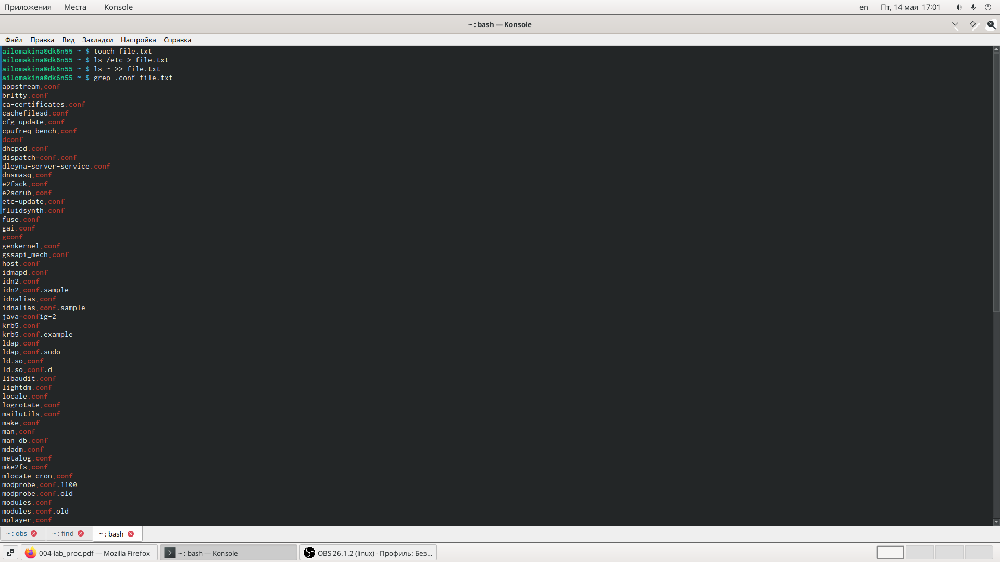
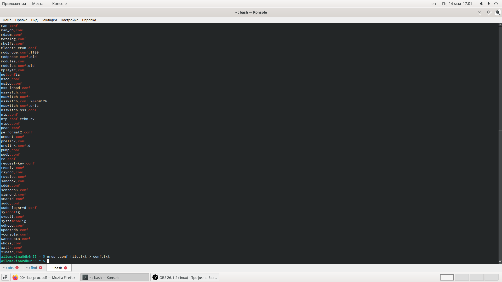
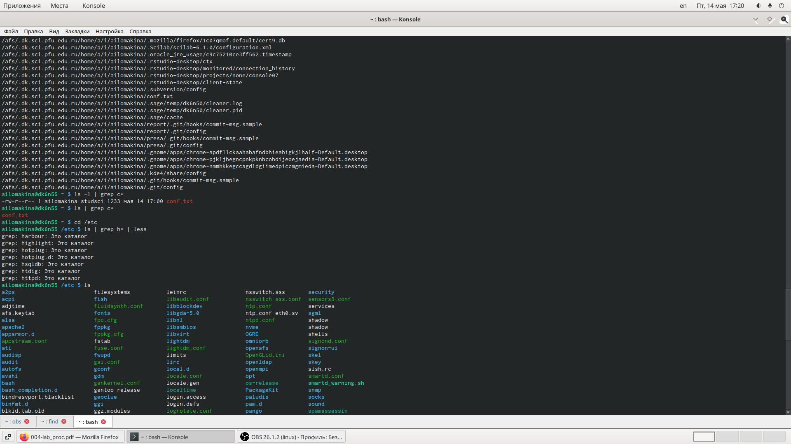
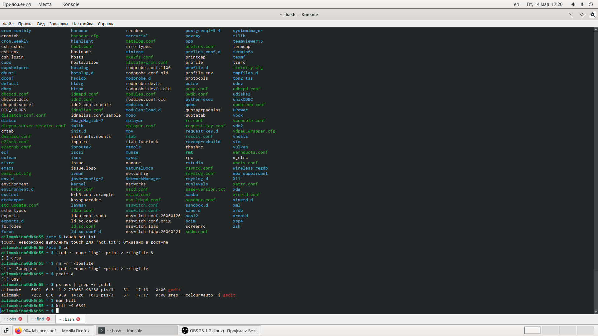
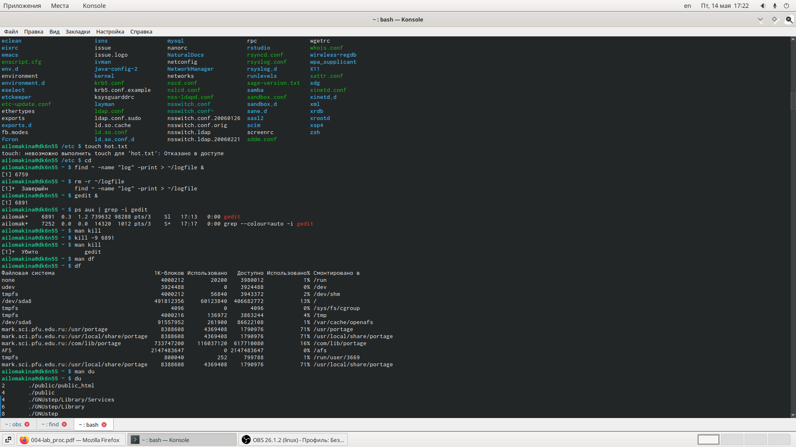
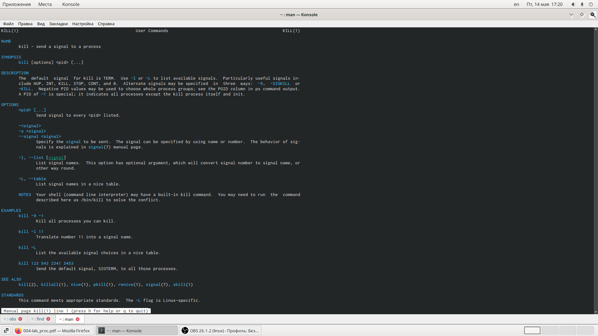
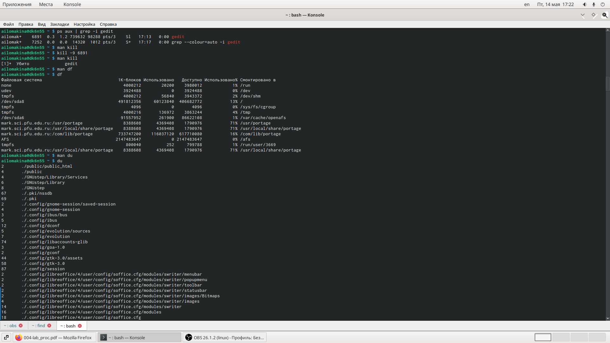
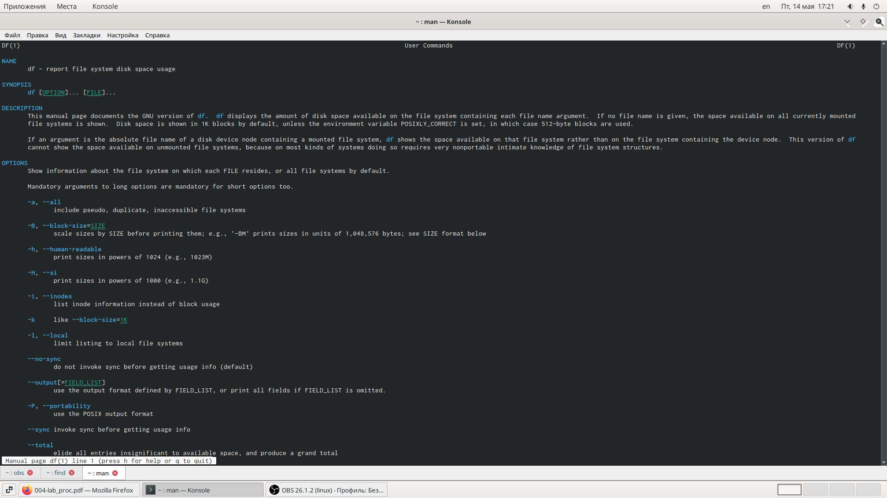
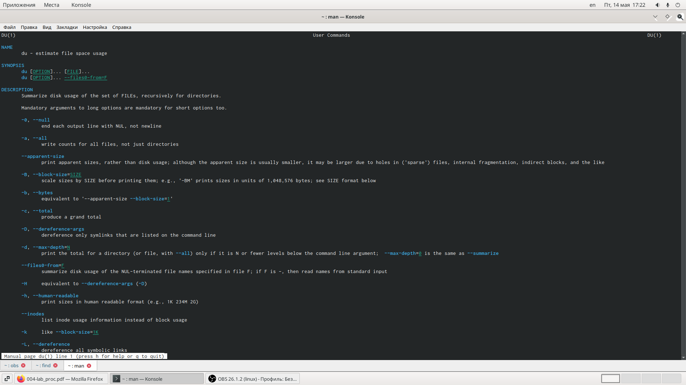
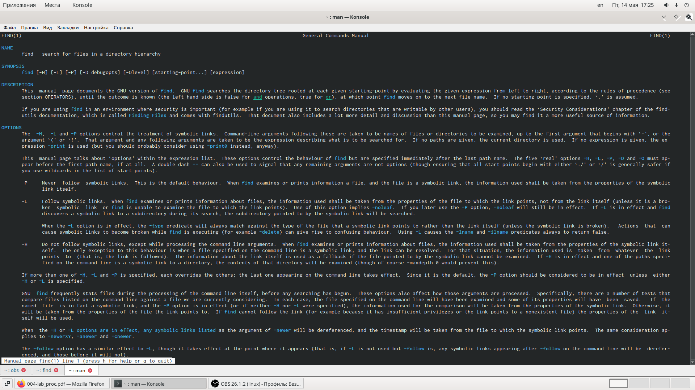

---
## Front matter
lang: ru-RU
title: Отчет по лабораторной работе №7
author: Lomakina Anna Ivanovna\inst{1}
institute: \inst{1}RUDN University, Moscow, Russian Federation
date: May--2021, 14 May -- 15 May, 2021 Moscow

## Formatting
toc: false
slide_level: 2
theme: metropolis
header-includes: 
 - \metroset{progressbar=frametitle,sectionpage=progressbar,numbering=fraction}
 - '\makeatletter'
 - '\beamer@ignorenonframefalse'
 - '\makeatother'
aspectratio: 43
section-titles: true
---

# Цель работы

Ознакомление с инструментами поиска файлов и фильтрации текстовых дан-ных. Приобретение практических навыков: по управлению процессами (и задания-ми), по проверке использования диска и обслуживанию файловых систем.

# Последовательность выполнения работы

## Задание 1 

Осуществите вход в систему, используя соответствующее имя пользователя.

## Задание 2 

Запишите в файл file.txt названия файлов, содержащихся в каталоге /etc.Допишите в этот же файл названия файлов, содержащихся в вашем домашнемкаталоге.

## Задание 3 

Выведите имена всех файлов из file.txt, имеющих расширение .conf, послечего запишите их в новый текстовой файл conf.txt.

## Задание 4 

Определите, какие файлы в вашем домашнем каталоге имеют имена, начинав-шиеся с символаc? Предложите несколько вариантов, как это сделать

## Задание 5

Выведите на экран (по странично) имена файлов из каталога /etc, начинающи-еся с символаh

## Задание 6

Запустите в фоновом режиме процесс, который будет записывать в файл ~/logfile файлы, имена которых начинаются сlog.

## Задание 7

Удалите файл ~/logfile.

## Задание 8

Запустите из консолив фоновом режимередакторgedit.

## Задание 9

Определите идентификатор процессаgedit, используя командуps, конвейер ифильтрgrep. Можно ли определить этот идентификатор более простым способом?

## Задание 10

Прочтите справку (man) команды kill, после чего используйте её для завершения процесса gedit.

## Задание 11

Выполните команды df и du, предварительно получив более подробную информацию об этих командах, с помощью команды man

## Задание 12

Воспользовавшись справкой команды find, выведите имена всех директорий,имеющихся в вашем домашнем каталоге

# Выполнение лабораторной работы

## Задание 1 

Осуществите вход в систему, используя соответствующее имя пользователя.

## Задание 2 

Запишите в файл file.txt названия файлов, содержащихся в каталоге /etc.Допишите в этот же файл названия файлов, содержащихся в вашем домашнем каталоге.

{ #fig:001 width=50% }

{ #fig:001 width=50% }

## Задание 3 

Выведите имена всех файлов из file.txt, имеющих расширение .conf, послечего запишите их в новый текстовой файл conf.txt.

{ #fig:001 width=50% }

## Задание 4 

Определите, какие файлы в вашем домашнем каталоге имеют имена, начинавшиеся с символаc? Предложите несколько вариантов, как это сделать

{ #fig:001 width=50% }

## Задание 5

Выведите на экран (по странично) имена файлов из каталога /etc, начинающиеся с символа h

## Задание 6

Запустите в фоновом режиме процесс, который будет записывать в файл ~/logfile файлы, имена которых начинаются с log.

{ #fig:001 width=50% }

## Задание 7

Удалите файл ~/logfile.

## Задание 8

Запустите из консолив фоновом режиме редактор gedit.

## Задание 9

Определите идентификатор процесса gedit, используя команду ps, конвейер ифильтр grep. Можно ли определить этот идентификатор более простым способом?

## Задание 10

Прочтите справку (man) команды kill, после чего используйте её для завершения процесса gedit.
{ #fig:001 width=50% }
{ #fig:001 width=50% }

## Задание 11

Выполните команды df и du, предварительно получив более подробную информацию об этих командах, с помощью команды man

{ #fig:001 width=50% }
{ #fig:001 width=50% }

## Задание 12

Воспользовавшись справкой команды find, выведите имена всех директорий,имеющихся в вашем домашнем каталоге
{ #fig:001 width=50% }
{ #fig:001 width=50% }

# Вывод

Я ознакомилась с файловой системой Linux, её структурой, именами и содержанием каталогов. Приобрела практические навыки по применению команд для работы с файлами и каталогами, по управлению процессами (и работами), по проверке использования диска и обслуживанию файловой системы.

## {.standout}

Спасибо за внимание!!!!

