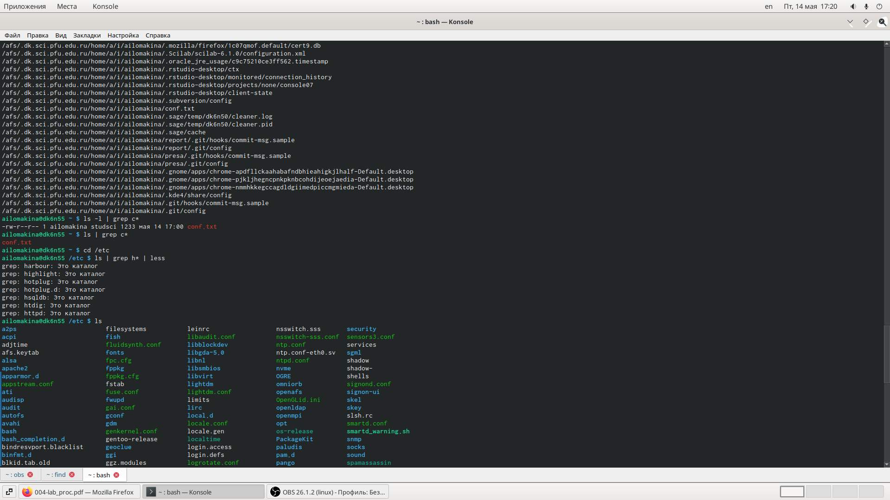
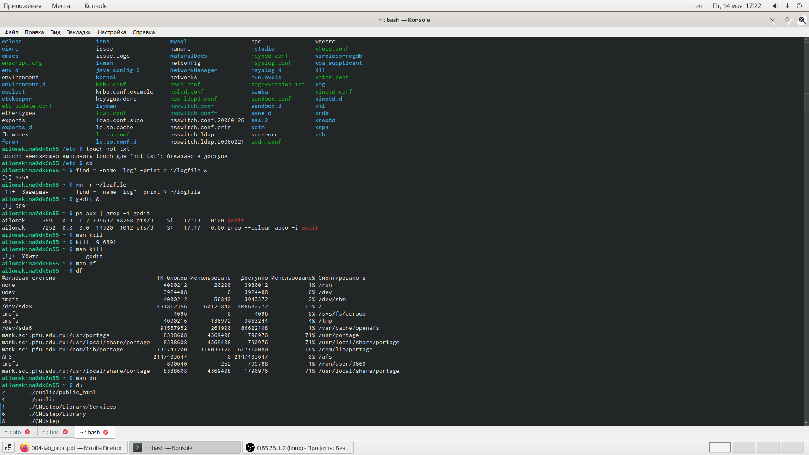
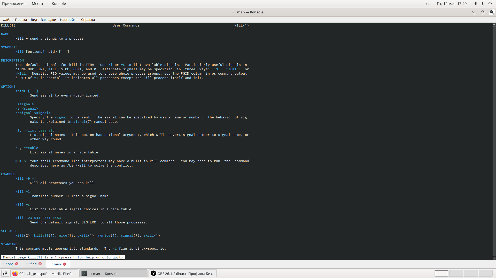
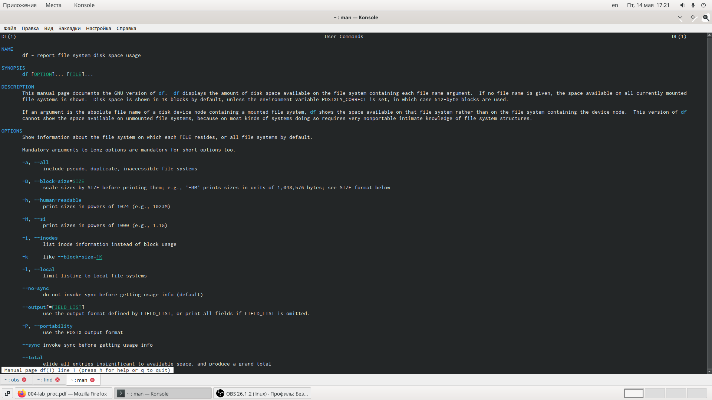
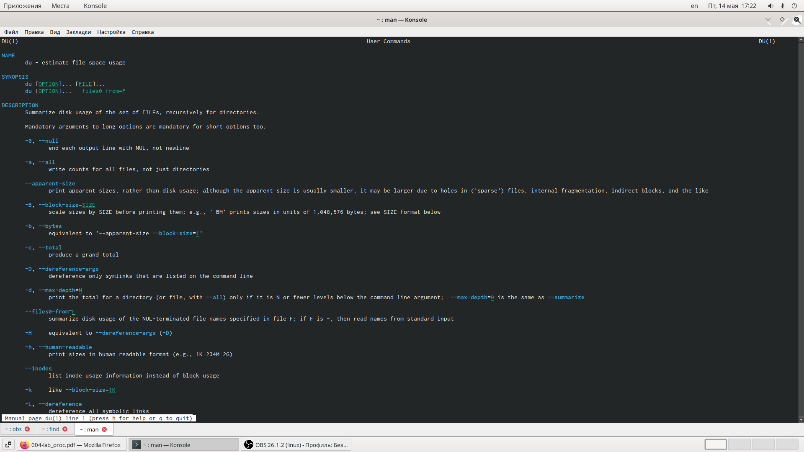
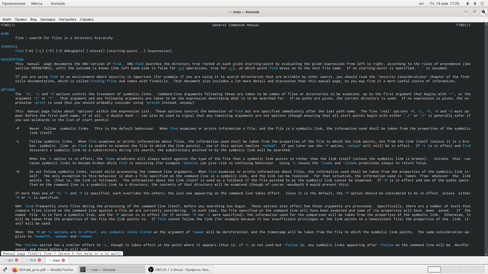

---
# Поиск файлов. Перенаправлениеввода-вывода. Просмотр запущенных процессов
lang: ru-RU
title: "Отчёт по лабораторной работе №7"
subtitle: " "
author: "Ломакина Анна Ивановна"

# Formatting
toc-title: "Содержание"
toc: true # Table of contents
toc_depth: 1
lof: true # List of figures
lot: true # List of tables
fontsize: 12pt
linestretch: 1.5
papersize: a4paper
documentclass: scrreprt
polyglossia-lang: russian
polyglossia-otherlangs: english
mainfont: PT Serif
romanfont: PT Serif
sansfont: PT Sans
monofont: PT Mono
mainfontoptions: Ligatures=TeX
romanfontoptions: Ligatures=TeX
sansfontoptions: Ligatures=TeX,Scale=MatchLowercase
monofontoptions: Scale=MatchLowercase
indent: true
pdf-engine: lualatex
header-includes:
  - \linepenalty=10 # the penalty added to the badness of each line within a paragraph (no associated penalty node) Increasing the value makes tex try to have fewer lines in the paragraph.
  - \interlinepenalty=0 # value of the penalty (node) added after each line of a paragraph.
  - \hyphenpenalty=50 # the penalty for line breaking at an automatically inserted hyphen
  - \exhyphenpenalty=50 # the penalty for line breaking at an explicit hyphen
  - \binoppenalty=700 # the penalty for breaking a line at a binary operator
  - \relpenalty=500 # the penalty for breaking a line at a relation
  - \clubpenalty=150 # extra penalty for breaking after first line of a paragraph
  - \widowpenalty=150 # extra penalty for breaking before last line of a paragraph
  - \displaywidowpenalty=50 # extra penalty for breaking before last line before a display math
  - \brokenpenalty=100 # extra penalty for page breaking after a hyphenated line
  - \predisplaypenalty=10000 # penalty for breaking before a display
  - \postdisplaypenalty=0 # penalty for breaking after a display
  - \floatingpenalty = 20000 # penalty for splitting an insertion (can only be split footnote in standard LaTeX)
  - \raggedbottom # or \flushbottom
  - \usepackage{float} # keep figures where there are in the text
  - \floatplacement{figure}{H} # keep figures where there are in the text
---

# Цель работы

# Последовательность выполнения работы

## Задание 1 

Осуществите вход в систему, используя соответствующее имя пользователя.

## Задание 2 

Запишите в файл file.txt названия файлов, содержащихся в каталоге /etc.Допишите в этот же файл названия файлов, содержащихся в вашем домашнемкаталоге.

## Задание 3 

Выведите имена всех файлов из file.txt, имеющих расширение .conf, послечего запишите их в новый текстовой файл conf.txt.

## Задание 4 

Определите, какие файлы в вашем домашнем каталоге имеют имена, начинав-шиеся с символаc? Предложите несколько вариантов, как это сделать

## Задание 5

Выведите на экран (по странично) имена файлов из каталога /etc, начинающи-еся с символаh

## Задание 6

Запустите в фоновом режиме процесс, который будет записывать в файл ~/logfile файлы, имена которых начинаются сlog.

## Задание 7

Удалите файл ~/logfile.

## Задание 8

Запустите из консолив фоновом режимередакторgedit.

## Задание 9

Определите идентификатор процессаgedit, используя командуps, конвейер ифильтрgrep. Можно ли определить этот идентификатор более простым спосо-бом?

## Задание 10

Прочтите справку (man) команды kill, после чего используйте её для заверше-ния процесса gedit.

## Задание 11

Выполните команды df и du, предварительно получив более подробную информацию об этих командах, с помощью команды man

## Задание 12

Воспользовавшись справкой команды find, выведите имена всех директорий,имеющихся в вашем домашнем каталоге

# Выполнение лабораторной работы

## Задание 1 

Осуществите вход в систему, используя соответствующее имя пользователя.

## Задание 2 

Запишите в файл file.txt названия файлов, содержащихся в каталоге /etc.Допишите в этот же файл названия файлов, содержащихся в вашем домашнем каталоге.

{ #fig:001 width=50% }

{ #fig:001 width=50% }

## Задание 3 

Выведите имена всех файлов из file.txt, имеющих расширение .conf, послечего запишите их в новый текстовой файл conf.txt.

{ #fig:001 width=50% }

## Задание 4 

Определите, какие файлы в вашем домашнем каталоге имеют имена, начинавшиеся с символаc? Предложите несколько вариантов, как это сделать

{ #fig:001 width=50% }

## Задание 5

Выведите на экран (по странично) имена файлов из каталога /etc, начинающиеся с символа h

## Задание 6

Запустите в фоновом режиме процесс, который будет записывать в файл ~/logfile файлы, имена которых начинаются с log.

{ #fig:001 width=50% }

## Задание 7

Удалите файл ~/logfile.

## Задание 8

Запустите из консолив фоновом режиме редактор gedit.

## Задание 9

Определите идентификатор процесса gedit, используя команду ps, конвейер ифильтр grep. Можно ли определить этот идентификатор более простым способом?

## Задание 10

Прочтите справку (man) команды kill, после чего используйте её для завершения процесса gedit.
{ #fig:001 width=50% }
{ #fig:001 width=50% }

## Задание 11

Выполните команды df и du, предварительно получив более подробную информацию об этих командах, с помощью команды man

{ #fig:001 width=50% }
{ #fig:001 width=50% }

## Задание 12

Воспользовавшись справкой команды find, выведите имена всех директорий,имеющихся в вашем домашнем каталоге
{ #fig:001 width=50% }
{ #fig:001 width=50% }

# Контрольные вопросы  

1.Какие потоки ввода вывода вы знаете?
В системе по умолчанию открыто три специальных потока:
–stdin— стандартный поток ввода (по умолчанию: клавиатура), файловый де-скриптор 0;
–stdout— стандартный поток вывода (по умолчанию: консоль), файловый де-скриптор 1;
–stderr— стандартный поток вывод сообщений об ошибках (по умолчанию:консоль), файловый дескриптор 2.

2.Объясните разницу между операцией > и >>.
Пояснительный пример:

1>filename
Перенаправление вывода (stdout) в файл "filename".
1>>filename
Перенаправление вывода (stdout) в файл "filename", файл открывается в режиме добавления.

3.Что такое конвейер?

Конвейер служит для объединения простых команд или утилит в цепочки,в которых результат работы предыдущей команды передаётся последующей. 

4.Что такое процесс? Чем это понятие отличается от программы?

Процесс - это выполнение программы. Он считается активной сущностью и реализует действия, указанные в программе. Несколько процессов могут быть связаны с одной и той же программой. 

Программа и процесс являются родственными терминами. Основное различие между программой и процессом заключается в том, что программа представляет собой группу инструкций для выполнения определенной задачи, тогда как процесс представляет собой программу в процессе выполнения. Хотя процесс является активной сущностью, программа считается пассивной.

Между процессом и программой существует отношение многие-к-одному, что означает, что одна программа может вызывать несколько процессов или, другими словами, несколько процессов могут быть частью одной и той же программы.

5.Что такое PID и GID?

PID - process identifier
GID - group identifier

6.Что такое задачи и какая команда позволяет ими управлять?

Запущенные фоном программы называются задачами (jobs). Ими можно управ-лять с помощью команды jobs, которая выводит список запущенных в данный момент задач. Для завершения задачи необходимо выполнить команду 
kill %номер задачи

7.Найдите информацию об утилитах top и htop. Каковы их функции?

top (table of processes) — консольная команда, которая выводит список работающих в системе процессов и информацию о них. По умолчанию она в реальном времени сортирует их по нагрузке на процессор. Программа написана для UNIX-совместимых операционных систем и опубликована под свободной лицензией GNU FDL.
Программа часто используется системными администраторами. Альтернативами программе top для GNU/Linux являются утилиты atop и htop.
 
htop — компьютерная программа, предназначенная для вывода на терминал списка запущенных процессов и информации о них (монитор процессов). Создана как альтернатива программы top. Написана на языке Си. Предоставляет пользователю текстовый интерфейс; для вывода на терминал использует библиотеку ncurses. 

8.Назовите и дайте характеристику команде поиска файлов. Приведите примерыиспользования этой команды.

Команда find используется для поиска и отображения имён файлов, соответствующих заданной строке символов.

9.Можно ли по контексту (содержанию) найти файл? Если да, то как?

Можно с помощью команды grep
Найти в текстовом файле указанную строку символов позволяет команда grep.
Формат команды:grep строка имя_файла 
Кроме того, команда grep способна обрабатывать стандартный вывод другихкоманд (любой текст). Для этого следует использовать конвейер, связав вывод команды с вводом grep.
Примеры:
1.Показать строки во всех файлах в вашем домашнем каталоге с именами, начина-ющимися на f, в которых есть слово begin:grep begin f*
2.Найти в текущем каталоге все файлы, в имени которых есть буквосочетание «лаб»:
Перенаправление ввода-вывода....ls -l | grep лаб

10.Как определить объем свободной памяти на жёстком диске?

Наafsможно посмотреть использованное пространство командойь fs quota

11.Как определить объем вашего домашнего каталога?

Командаduпоказывает число килобайт, используемое каждым файлом или ка-талогом.
Формат команды:
du[-опции][имя_файла...]
Пример.
du -a ~/
Так мы узнаем какой процент памяти из общего объема домашнего каталога занят.Например у меня это :
86% of quota used.

12.Как удалить зависший процесс?
Надо использовать команды ps,kill,killall.

# Выводы
Я ознакомилась с файловой системой Linux, её структурой, именами и содержанием каталогов. Приобрела практические навыки по применению команд для работы с файлами и каталогами, по управлению процессами (и работами), по проверке использования диска и обслуживанию файловой системы.
